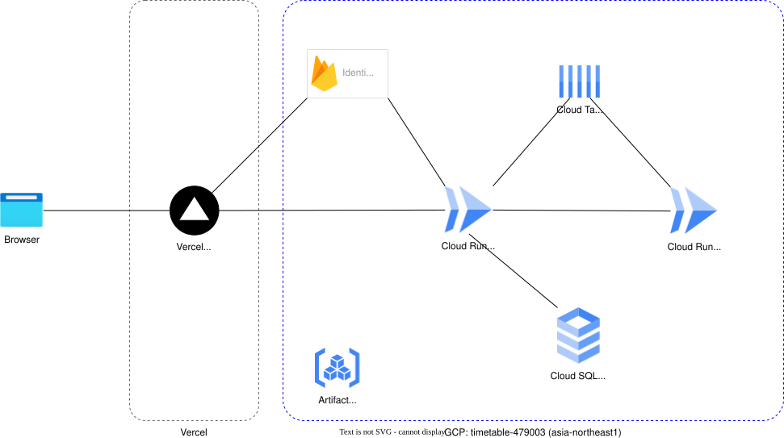

# timetable-infrastructure

時間割アプリのIaC

## 構成図



### 管理対象リソース

- **Cloud Run**: アプリケーションのコンテナ実行環境
- **Cloud SQL**: PostgreSQLデータベース
- **Identity Platform**: Firebase Authentication（IdP）
- **IAM**: サービスアカウントと権限管理

### 環境

- **sandbox**: 既存リソースを管理する実験・検証環境
- **dev**: 開発環境（将来実装予定）
- **prod**: 本番環境（将来実装予定）

## ディレクトリ構成

```
infra/
├── .gitignore
├── README.md
├── scripts/                  # 運用スクリプト
│   └── firebase-admin/       # Identity Platform ADMIN用
└── terraform/
    ├── environments/          # 環境別の設定
    │   └── sandbox/          # Sandbox環境
    │       ├── main.tf       # メイン設定
    │       ├── variables.tf  # 変数定義
    │       ├── outputs.tf    # 出力定義
    │       ├── backend.tf    # State管理設定
    │       └── terraform.tfvars.example  # 設定例
    └── modules/              # 再利用可能なモジュール
        ├── cloud_run/        # Cloud Runモジュール
        ├── cloud_sql/        # Cloud SQLモジュール
        ├── cloud_tasks/      # Cloud Tasksモジュール（最適化ジョブキュー）
        ├── firebase_admin_sa/  # Admin SDK用サービスアカウント
        ├── identity_platform/  # Identity Platformモジュール
        ├── vpc/              # VPCモジュール
        └── iam/              # IAMモジュール
```

## 日常的な運用

### Identity Platform ユーザー管理

ユーザーのCRUD（通常のメンバー管理はアプリの`/members`画面。これはブートストラップと非常口）:

```bash
cd scripts/firebase-admin

# 初回のみ: 依存関係をインストール
npm install

# 作成 / 照会 / 更新 / 削除
node create-user.js <email> <password> [displayName] [schoolId] [roles]
node get-user.js <uid|email>          # または --school-id <schoolId> で一覧
node update-user.js <uid|email> [--roles USER,ADMIN] [--school-id x] [--password x]
node delete-user.js <uid|email> --yes
```

詳細は [`scripts/firebase-admin/README.md`](./scripts/firebase-admin/README.md) を参照してください。

### Terraform による設定変更

1. **変更前の確認**
   ```bash
   terraform plan
   ```

2. **変更の適用**
   ```bash
   terraform apply
   ```

3. **適用結果の確認**
   ```bash
   terraform show
   ```

### リソースの状態確認

```bash
# すべてのリソースを表示
terraform state list

# 特定のリソースの詳細を表示
terraform state show module.cloud_run.google_cloud_run_service.main
```

### State管理

#### Stateのバックアップ

```bash
terraform state pull > terraform.tfstate.backup
```

#### Stateの同期

```bash
terraform refresh
```

## セキュリティ

### 機密情報の管理

- `terraform.tfvars`: Gitにコミットしない（`.gitignore`に含まれています）
- データベースパスワード: Secret Managerの使用を推奨
- サービスアカウントキー: ローカルに保存せず、Cloud IAMで管理

### 手動管理リソース

以下のリソースはTerraformの管理対象外としています：

- **Cloud SQL ユーザー**: パスワード管理の複雑さを避けるため、`cloud_sql_users = []`を設定し、GCPコンソールまたはgcloudコマンドで直接管理
- **Cloud Run Service Account**: 既存のCI/CDパイプライン（Cloud Build）で使用されているため、既存の`cloud-run-sa`を参照する形で利用
- **コンテナイメージ**: デプロイはCloud Build（mainへのpushトリガー）。Terraformは`image`を`ignore_changes`とし、構成（環境変数・IAM・リソース設定）のみを管理してCloud Buildのデプロイを巻き戻さない
- **front-app**: GCP外（Vercel）。Git連携CIで自動デプロイ（main=本番、ブランチ=プレビュー）。環境変数はVercelプロジェクト設定で管理
